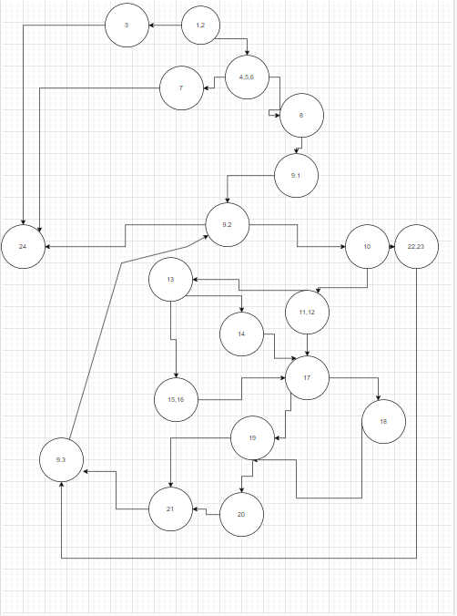

# SI_2022_lab2_202029

3.Цикломатската комплексност на овој код ја добива со бројот на регионите. Бројот на регионите може да го пресметаме со бројот на edges - бројот на nodes + 2(edges)=27-20+2=9 
 
4.Every Statement
 

4. За every statement критириумот прво ставаме тестови за да ги опфатиме исклучоците. Затоа првиот тест е со празна листа за да го опфати првиот исклучок ("List length should be greater than 0")
, потоа вториот тест е листа само со два члена за да немаме квадратна матрица и со овој тест го опфаќаме исклучокот ("List length should be a perfect square"), и со последниот тест пример се одбегнуваат сите исклучоци и се поминуваат сите останати линии во кодот.

5.Every Branch

5.Како и кај Every Statement критириумот првите два теста се за да ги опфатиме исклучоците на кодот.Првиот тест праќаме празна листа да отиде во исклучокот за празна листа("List length should be greater than 0"), а за вториот тест го даваме истиот тест како и во Every Statement со два члена во листата за да немаме квадратна матрица и да го опфатиме исклучокот("List length should be a perfect square").За Every Branch критириумот не можеме да го имаме истиот тест како и кај Every Statement затоа тука ни е потребна матрица 4x4 за да  помине секој branch. 
